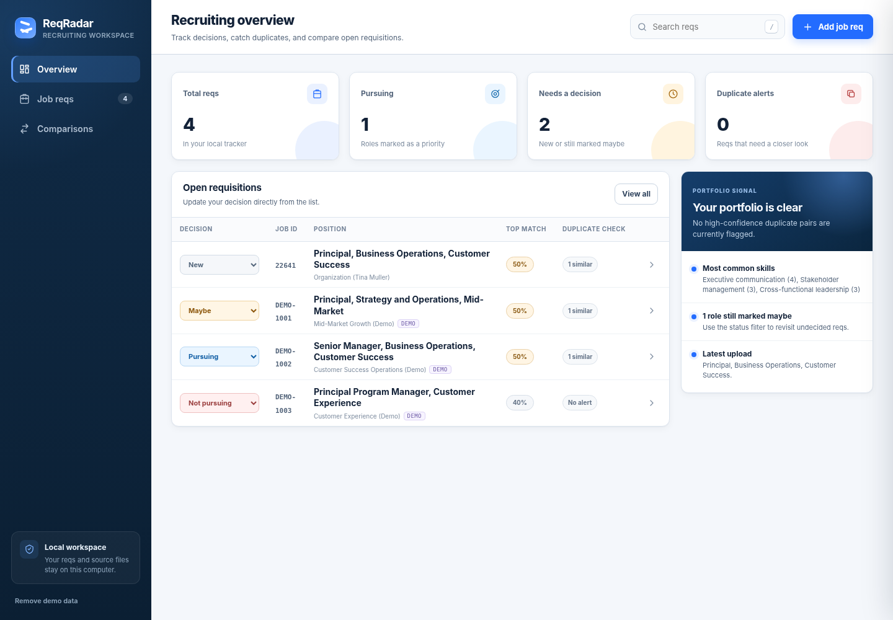
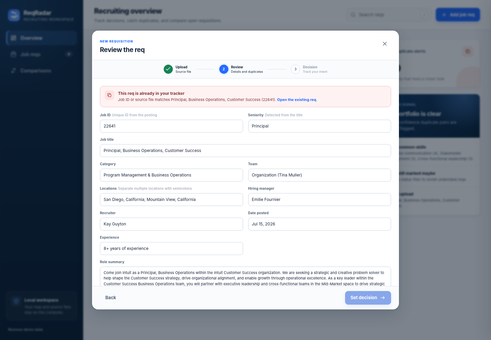

# ReqRadar

ReqRadar is a local-first web app for quickly uploading job requisitions, checking whether a req is already in the tracker, comparing it with other roles, and recording whether you plan to pursue it.

## Included in this MVP

- PDF and TXT upload, plus pasted job-posting text.
- Automatic extraction of Job ID, title, category, team, location, hiring manager, recruiter, date posted, seniority, experience, summary, responsibilities, qualifications, and common skills.
- Exact duplicate detection using Job ID and SHA-256 file identity.
- Possible-duplicate and related-role comparison using title, skills, category, team, location, hiring manager, and seniority.
- Decision statuses: New, Pursuing, Maybe, Not pursuing, and Applied.
- Search, status filters, comparison cards, personal notes, and access to the saved source file.
- Optional demo portfolio and the provided sample PDF for immediate testing.
- Local SQLite storage. No external AI or cloud service is required.

## Preview





## Start on macOS or Linux

```bash
./start.sh
```

Then open `http://127.0.0.1:8000`.

## Start on Windows

Double-click `start.bat`, or run it from Command Prompt. Then open `http://127.0.0.1:8000`.

## Manual start

```bash
python3 -m venv .venv
source .venv/bin/activate
python -m pip install -r requirements.txt
python app.py
```

On Windows, activate with `.venv\Scripts\activate`.

## Docker

```bash
docker build -t reqradar .
docker run --rm -p 8000:8000 -v reqradar-data:/app/data reqradar
```

## Data and privacy

The default database and uploaded source files are stored under `data/` inside the app folder. The app does not call an external AI service. To use another storage location, set `REQ_RADAR_DATA_DIR` before starting the server.

## Current limitations

- PDF extraction works best when text is selectable. Scanned-image PDFs require OCR, which is not included in this MVP.
- Skill extraction and similarity scoring are deterministic heuristics. They are transparent and editable, but not a substitute for a production-grade semantic model.
- This version is intended for one local user. Authentication, shared workspaces, ATS integration, and enterprise deployment controls are not included yet.
